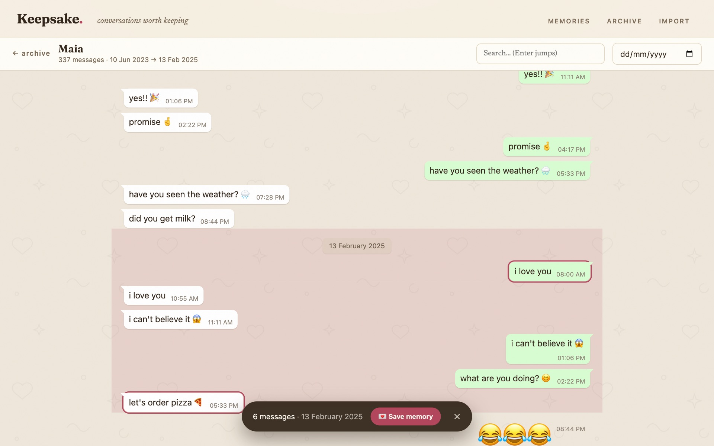
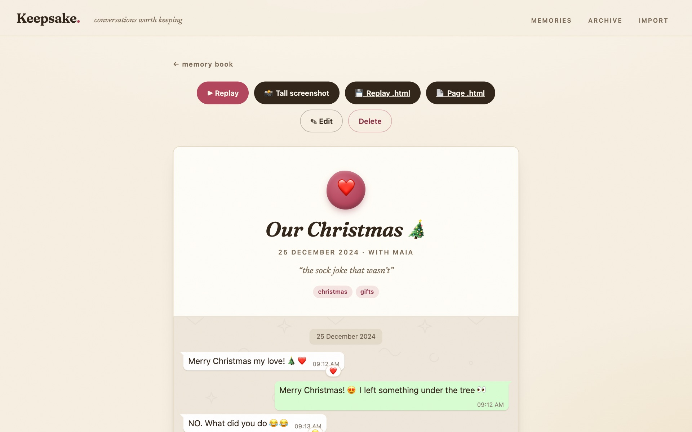
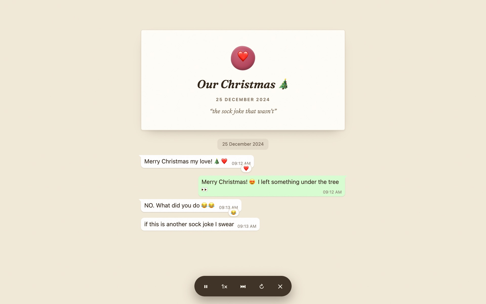

# Keepsake 💌

> A local-first memory book for your WhatsApp conversations: save, replay
> and screenshot the moments worth keeping.

Some conversations are too good to lose to an endless scroll: the night you
planned the trip, the joke that became a whole language, the message you
re-read on hard days. Keepsake turns slices of a chat into **memories**:
self-contained, beautifully rendered, and stored as plain files that will
outlive any app.

Everything runs on your machine. No cloud, no accounts, no telemetry,
your conversations never leave your computer.

| Pick a moment | Keep it forever | Relive it |
| --- | --- | --- |
|  |  |  |

*(Screenshots show the bundled synthetic demo chat.)*

## What it does

- **Import** your chats two ways: the official *Export chat* zip, or, for the
  full history, straight from a decrypted Google Drive backup's
  `msgstore.db`, read natively (reactions ❤️, edit flags and media included).
  Imports **merge and dedupe**, so re-importing or combining sources just
  works.
- **Browse** a WhatsApp-faithful archive that stays smooth at 250,000+
  messages: search, jump-to-date, and a floating day indicator while you
  scroll.
- **Save memories**: click the first message, click the last, give it a title,
  a note and tags. Each memory freezes its own copy of the messages and media.
- **The memory book**: a gallery of keepsake cards, each sealed with the
  conversation's most-used emoji, filterable by tag.
- **Relive and share**:
  - *Replay*: messages appear one by one with a typing indicator (1×/2×/4×)
  - *Tall screenshot*: the whole memory as one retina PNG, any length
  - *Replay .html* / *Page .html*: single self-contained files (media
    inlined) that open anywhere, forever, no app, no server
- **The details**: emoji render natively (jumbo when they stand alone),
  stickers sit on the wallpaper without a bubble, WhatsApp GIF-mp4s loop
  silently, voice notes play inline, edited messages are marked, and media
  from backups is attached by **hardlink**, zero duplicated disk space.

## Quick start

**Download**: grab a single-file build for macOS / Windows / Linux from
[Releases](https://github.com/sokie/keepsake/releases): run it, your browser
opens, and everything lives in `~/Keepsake`.

**Or run from source** (Node 24+: the backup importer uses the built-in
`node:sqlite`):

```bash
npm install
npm run dev          # API on :3010, app on http://localhost:5173
```

Want to poke around first? `npm run fixtures` generates a synthetic demo
chat, import `fixtures/sample-export.zip` from the Import page and pick
"Alex" as you.

## Getting your conversation in

### Option 1: Export chat (recommended)

On your phone: open the chat → **⋮ → More → Export chat** → *Include media* →
send the .zip to your computer → drop it on the Import page. That's the whole
flow, and for most people it's all you ever need. Re-export any time: new
messages merge in automatically.

### Option 2: full history from your Google Drive backup (advanced)

Exports are capped on some builds and always drop emoji reactions. If you want
everything, [wabdd](https://github.com/giacomoferretti/whatsapp-backup-downloader-decryptor)
downloads and decrypts your phone's own end-to-end-encrypted Google Drive
backup, and Keepsake reads the resulting `msgstore.db` directly, no other
tooling. Follow **[docs/full-archive-android.md](docs/full-archive-android.md)**,
paste the dump folder on the Import page, and choose "Add into → your existing
chat" so both sources merge into one timeline. (Legacy
[wtsexporter](https://github.com/KnugiHK/Whatsapp-Chat-Exporter) `result.json`
folders are also accepted.)

## What a saved memory is

A folder under `data/memories/<id>/` holding `memory.json` (a frozen copy of
the selected messages), the referenced media files, and any exported PNG.
Memories are **self-contained**: they survive re-imports and chat deletions,
and being plain JSON plus ordinary media files, they'll still be readable
decades from now. Back up `data/memories/` and your memories are safe.

## Commands

| command | what it does |
| --- | --- |
| `npm run dev` | run server + app in dev mode |
| `npm test` | unit tests (parsers, msgstore importer, merge/dedupe, emoji) |
| `npm run build && npm start` | production build served at :3010 |
| `npm run fixtures` | regenerate the synthetic demo chat |
| `npm run package` | build a single-file executable for this OS (Node SEA) |
| `node scripts/screenshot.mjs <outdir> [memoryId]` | dev utility: UI screenshots via system Chrome |

## Project layout

```
server/        Express API: imports, merge, storage, HTML-export rendering
  lib/         importers (export .txt, msgstore.db via node:sqlite,
               wtsexporter JSON), merge logic + tests
src/           React app: gallery, archive, chat view, memory page, replay
shared/        types + emoji helpers used by both sides
fixtures/      synthetic demo chat in both source formats (no real data)
data/          YOUR conversations & memories (gitignored, never committed)
```

## Privacy & good citizenship

- Conversations never leave your machine; the server binds to localhost.
- `data/` and `uploads/` are gitignored, so your chats stay out of version
  control even after `git init`.
- No unofficial WhatsApp clients or APIs are involved: both import paths read
  files WhatsApp itself gave you (an export, or your own Google Drive backup).
  Nothing here talks to WhatsApp's servers, and nothing risks your account.

*WhatsApp is a trademark of WhatsApp LLC. Keepsake is an independent personal
archiving tool and is not affiliated with, sponsored or endorsed by WhatsApp
or Meta.*
